<div align="center">

# @keelstack/guard

**The action firewall for AI agents.**

Stop an agent from executing the wrong action twice, exceeding its authority, overspending a budget, or performing a sensitive side effect without approval.



`guard()` sits at the last responsible moment before a tool side effect actually happens.

</div>

---

## Why this exists

Modern agent frameworks can decide **which tool to call**, retry calls, run tools concurrently, and pause for approval. That still leaves an application-level question:

> **Should this exact action, with these exact arguments, be allowed to execute right now?**

That is the boundary Guard owns.

A model can be wrong because of a retry, hallucination, prompt injection, stale state, or a legitimate plan that simply exceeds the authority you intended to give it. Guard turns those failure modes into deterministic runtime decisions.

### The five failure modes Guard handles

| Failure | Guard behavior |
|---|---|
| Same action retried | Replays the stored result instead of repeating the side effect |
| Same idempotency key reused with changed arguments | Blocks with `blocked:intent-conflict` |
| Sensitive action needs review | Returns `pending:approval` before execution |
| Agent exceeds call or monetary authority | Blocks with `blocked:authority` |
| Projected AI/API spend exceeds budget | Blocks with `blocked:budget` before the call |

Every decision also produces a structured **decision receipt** for audit logs, dashboards, or observability.

---

## Install

```bash
npm install @keelstack/guard
```

Requirements: Node.js 22+.

---

## The core pattern

```ts
import { guard } from '@keelstack/guard';

const intent = {
  tool: 'refund_payment',
  args: {
    paymentId,
    amountUsd,
    customerId,
  },
};

const result = await guard({
  key: `refund:${refundRequestId}`,

  // Bind the idempotency key + approval to the exact action arguments.
  intent,

  metadata: {
    tool: 'refund_payment',
    actor: `support-agent:${agentId}`,
    resource: `payment:${paymentId}`,
    summary: `Refund $${amountUsd} to ${customerId}`,
  },

  // Limit the blast radius of this agent/session.
  authority: {
    id: `support-agent:${agentId}`,
    maxExecutions: 20,
    maxValueUsd: 500,
    valueUsd: amountUsd,
    windowMs: 60 * 60 * 1000,
  },

  // Framework-neutral human approval.
  approval: {
    required: amountUsd >= 100,
  },

  action: () => payments.refund({ paymentId, amountUsd }),

  onDecision: (receipt) => auditLog.write(receipt),
});

if (result.status === 'pending:approval') {
  // Persist/show this hash in your approval UI or workflow state.
  return {
    needsApproval: true,
    intentHash: result.approvalInfo?.intentHash,
    summary: 'Refund requires review',
  };
}
```

If a human approves it, call the same guarded action again with an approval bound to the returned intent hash:

```ts
const resumed = await guard({
  key: `refund:${refundRequestId}`,
  intent,
  metadata,
  authority,
  action: () => payments.refund({ paymentId, amountUsd }),
  approval: {
    required: true,
    decision: {
      status: 'approved',
      intentHash: approvedIntentHash,
      by: reviewerUserId,
    },
  },
});
```

If the agent changes `amountUsd`, `paymentId`, or any other value inside `intent`, the hash changes and the old approval cannot authorize the new action.

---

## 1. Intent-bound idempotency

Classic idempotency answers:

> “Have I seen this key before?”

Agentic idempotency also needs to answer:

> “Does this retry still mean the same thing?”

```ts
const first = await guard({
  key: 'email:job-42',
  intent: {
    tool: 'send_email',
    args: { to: 'alice@example.com', subject: 'Welcome' },
  },
  action: sendEmailToAlice,
});

const mutatedRetry = await guard({
  key: 'email:job-42',
  intent: {
    tool: 'send_email',
    args: { to: 'bob@example.com', subject: 'Welcome' },
  },
  action: sendEmailToBob,
});

console.log(mutatedRetry.status); // "blocked:intent-conflict"
```

Guard canonicalizes and SHA-256 fingerprints the supplied intent. Same key + same intent replays. Same key + different intent is blocked.

For basic backwards-compatible deduplication, `intent` is optional, but important side effects should provide it.

---

## 2. Scoped authority and circuit breakers

An agent should not inherit unlimited authority just because it can call a tool.

```ts
await guard({
  key: `notify:${campaignId}:${customerId}`,
  intent: { tool: 'send_sms', args: { customerId, campaignId } },
  authority: {
    id: `campaign-agent:${campaignId}`,
    maxExecutions: 100,
    windowMs: 60_000,
  },
  action: () => sendSms(customerId),
});
```

For money-moving or value-bearing actions:

```ts
authority: {
  id: `purchasing-agent:${sessionId}`,
  maxExecutions: 8,
  maxValueUsd: 250,
  valueUsd: purchaseAmountUsd,
  windowMs: 15 * 60_000,
}
```

The default `MemoryAuthorityStore` is process-local. Multi-instance production systems should implement `AuthorityStore.checkAndConsume()` atomically in Redis, Postgres, Durable Objects, etc.

---

## 3. Framework-neutral approvals

Guard does not force you into its own UI, queue, graph, or agent framework.

The first call can return:

```ts
{
  status: 'pending:approval',
  approvalInfo: {
    key: '...',
    intentHash: '...',
    required: true,
    status: 'pending'
  }
}
```

Persist that state wherever your framework expects it. Resume later by passing an `ApprovalDecision` containing the same `intentHash`.

A mismatched approval is rejected with `blocked:approval`.

This works underneath OpenAI Agents SDK, Vercel AI SDK, LangGraph, Mastra, MCP tools, queues, background jobs, or custom loops because the enforcement happens around the side effect itself.

---

## 4. Budget pre-authorization

The previous budget model only knew whether the budget had already been exhausted. That is not enough when the *next* call can push you over the cap.

Use `estimatedCostUsd` to block before execution:

```ts
const result = await guard({
  key: `research:${userId}:${requestId}`,
  intent: { tool: 'run_research', args: { requestId } },
  budget: {
    id: userId,
    limitUsd: 2,
    estimatedCostUsd: 0.35,
    warnAt: [0.5, 0.8],
  },
  action: () => runModel(),
  extractCost: (response) => response.actualCostUsd,
});
```

Guard accounts for same-process in-flight reservations so concurrent estimated calls cannot all pass the same budget check.

If `extractCost` is supplied, actual cost is recorded after success. If only `estimatedCostUsd` is supplied, the estimate is recorded.

---

## 5. Risk gate

Risk classification remains available as a simple deterministic rule:

```ts
const result = await guard({
  key: `delete:${recordId}`,
  intent: { tool: 'delete_record', args: { recordId } },
  risk: {
    level: 'irreversible',
    policy: 'block',
  },
  action: () => db.records.delete(recordId),
});
```

Levels: `safe | reversible | irreversible`

Policies: `allow | log | warn | block`

MCP tool annotations can help describe tool risk, but the MCP specification treats annotations as hints rather than trusted enforcement. Guard belongs on the trusted application side of that boundary.

---

## Decision receipts

Every non-throwing Guard decision includes `receipt`:

```ts
{
  id: 'cda9…',
  key: 'refund:req-42',
  status: 'blocked:authority',
  timestamp: 1786123456789,
  intentHash: '7d8b…',
  metadata: {
    tool: 'refund_payment',
    actor: 'support-agent:agent-7',
    resource: 'payment:pay_123'
  },
  reason: 'action would exceed the authority value limit',
  authorityInfo: { /* ... */ }
}
```

Use `onDecision` to stream receipts into your existing audit system:

```ts
onDecision: (receipt) => logger.info({ event: 'agent_action_decision', ...receipt })
```

Guard deliberately does not require a hosted dashboard. The receipt is the portable primitive; you decide where it goes.

---

## Result statuses

```ts
type GuardResultStatus =
  | 'executed'
  | 'replayed'
  | 'pending:approval'
  | 'blocked:approval'
  | 'blocked:intent-conflict'
  | 'blocked:authority'
  | 'blocked:budget'
  | 'blocked:risk';
```

---

## Storage

Guard ships with zero-config in-memory stores:

```ts
import {
  MemoryLedger,
  MemoryBudgetStore,
  MemoryAuthorityStore,
} from '@keelstack/guard';
```

They are useful for local development, single-process services, and isolated tests.

For multi-instance production deployments, provide shared implementations:

```ts
await guard({
  key,
  intent,
  action,
  ledger: redisLedger,
  budgetStore: redisBudgetStore,
  authorityStore: redisAuthorityStore,
});
```

Important production property: `AuthorityStore.checkAndConsume()` should be atomic. Your ledger should also provide race-safe same-key semantics across workers.

---

## Existing simple usage still works

```ts
const result = await guard({
  key: `send-welcome:${userId}`,
  action: () => resend.emails.send({
    to: user.email,
    subject: 'Welcome',
  }),
});

console.log(result.status); // executed | replayed
```

No framework dependency. No runtime package dependency.

---

## Where Guard fits

Framework guardrails are useful for model inputs, outputs, and framework-specific tool approval flows. Guard solves a narrower but harder-to-skip boundary:

```text
model / planner
      ↓
agent framework
      ↓
tool call proposal
      ↓
@keelstack/guard   ← intent + approval + authority + budget + audit
      ↓
real side effect
```

The package is intentionally small enough to audit and boring enough to put in front of payments, messaging, writes, and other consequential agent actions.

---

## Design references

The direction of Guard follows the same safety pressure visible across the agent ecosystem:

- [OWASP Agentic AI guidance](https://cornucopia.owasp.org/edition/companion/AAIA/1.0/en): least-privilege agency, human review for high-impact actions, resource budgets/circuit breakers, and action logging.
- [NIST 2026 work on software-agent identity and authorization](https://www.nist.gov/news-events/news/2026/02/new-concept-paper-identity-and-authority-software-agents).
- [MCP tool annotations](https://blog.modelcontextprotocol.io/posts/2026-03-16-tool-annotations/): risk vocabulary for read-only, destructive, idempotent, and open-world tools, explicitly described as hints rather than enforcement.
- [Stripe idempotency](https://docs.stripe.com/api/idempotent_requests): a reused key must correspond to the same request parameters rather than silently changing meaning.

Guard turns those ideas into a small application-level primitive for TypeScript agent side effects.

---

## License

MIT
